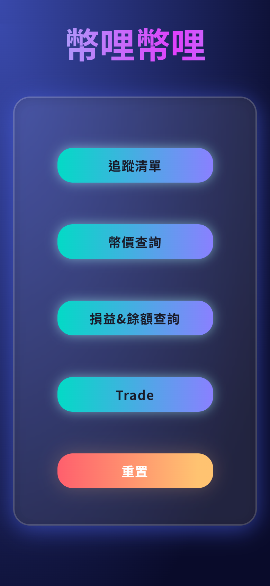
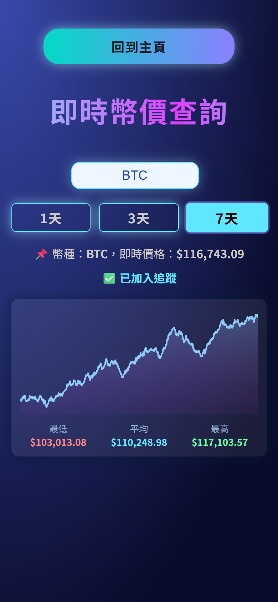
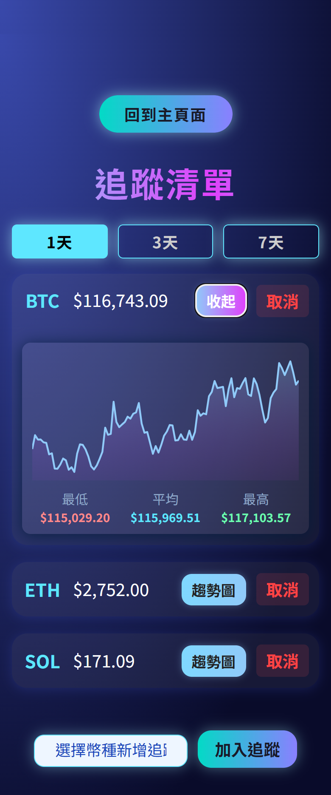
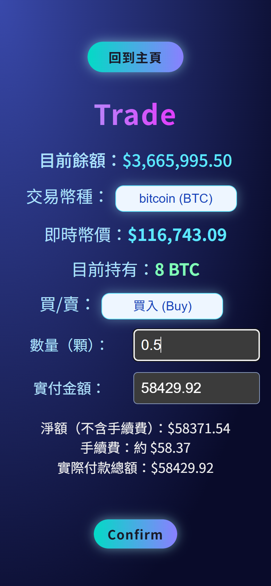
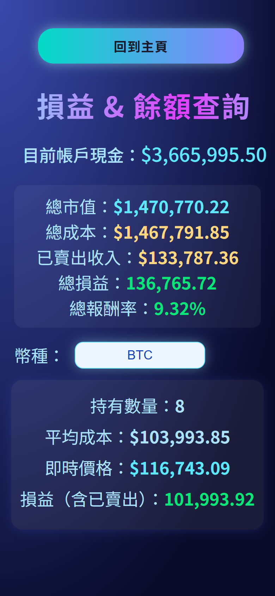
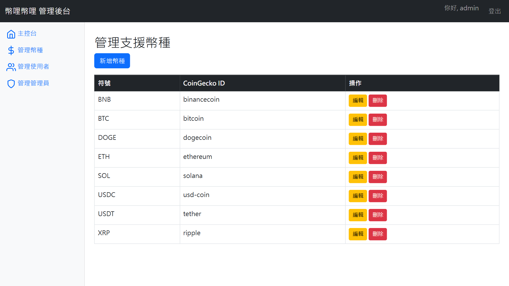
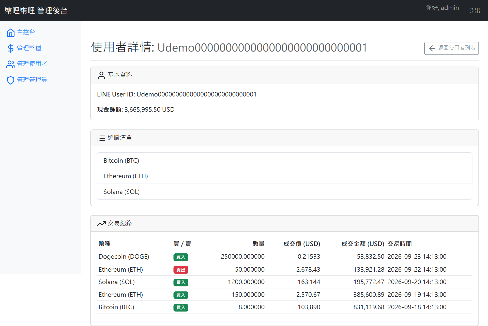
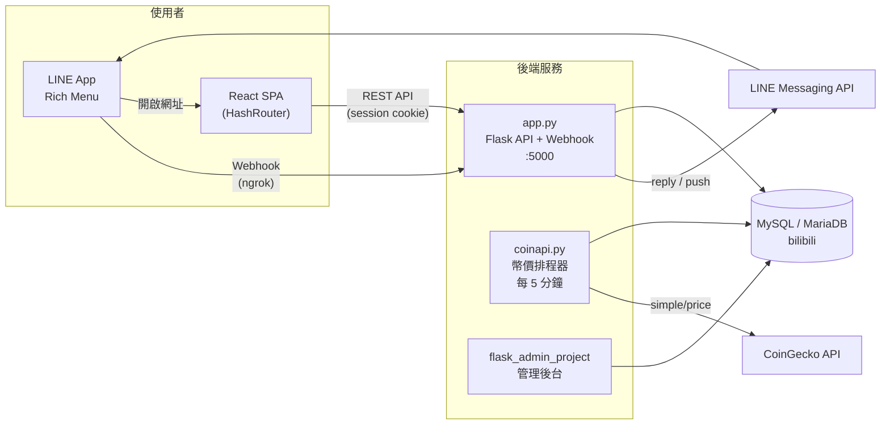
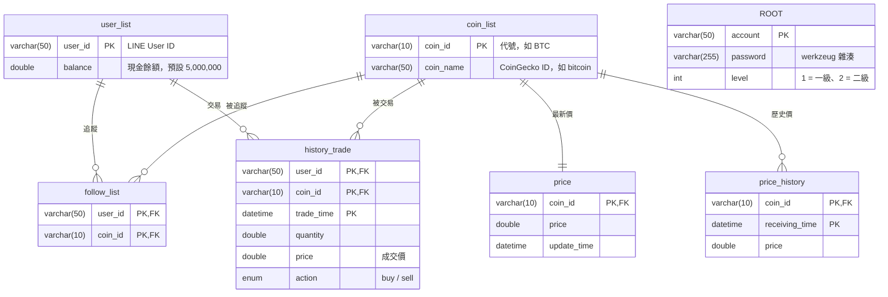

<div align="center">

# 幣哩幣哩 BiliBili Coin

**結合 LINE Bot 的加密貨幣模擬投資平台**

在零風險的環境中查詢即時幣價、追蹤幣種、模擬買賣，累積投資經驗。


資料庫系統設計 期末專題

</div>

---

## 目錄

- [專案簡介](#專案簡介)
- [功能特色](#功能特色)
- [畫面展示](#畫面展示)
- [系統架構](#系統架構)
- [技術棧](#技術棧)
- [專案結構](#專案結構)
- [資料庫設計](#資料庫設計)
- [快速開始](#快速開始)
- [測試](#測試)
- [API 參考](#api-參考)
- [核心業務邏輯](#核心業務邏輯)
- [已知限制](#已知限制)
- [參考資料](#參考資料)

---

## 專案簡介

「幣哩幣哩」是以虛擬加密貨幣為核心的模擬投資平台。系統透過 **CoinGecko API** 定時抓取即時幣價並寫入資料庫，使用者只要在 LINE 加入官方帳號好友，系統就會自動建立帳戶並發放 **5,000,000 USD** 的模擬資金。

使用者透過 LINE 的 Rich Menu 進入 React 網頁介面，可以查詢幣價、繪製趨勢圖、追蹤幣種、進行買賣並查看損益。破產或想重新開始時，可以一鍵重置帳戶。管理者則透過獨立的後台系統維護幣種資料與使用者帳號。

---

## 功能特色

### 使用者端（LINE Bot + React Web）

| 功能 | 說明 |
| --- | --- |
| **自動開戶** | 加入 LINE 好友時觸發 `FollowEvent`，自動寫入 `user_id` 並發放 500 萬初始資金，同時綁定 Rich Menu |
| **即時幣價查詢** | 下拉選單選擇幣種，顯示即時價格與 1 天 / 3 天 / 7 天趨勢圖 |
| **追蹤清單** | 新增、移除追蹤幣種，並逐一查看各幣種趨勢圖 |
| **模擬交易** | 以「數量」或「金額」下單，買賣時即時換算，並收取 **0.1% 手續費** |
| **損益與餘額** | 顯示現金餘額、總市值、總成本、總損益、總報酬率，以及單一幣種的持有數量、平均成本與未實現損益 |
| **帳戶重置** | 清除全部交易紀錄，餘額恢復為 5,000,000 USD |
| **價格異動推播** | 每 5 分鐘比對一次，已追蹤幣種 5 分鐘內漲跌超過 **±5%** 時，主動推播 LINE 通知 |

### 管理者端（Flask Admin）

| 功能 | 一級管理員 | 二級管理員 |
| --- | :---: | :---: |
| 查詢 / 新增 / 編輯 / 刪除幣種（新增後自動開始抓價） | ✅ | ✅ |
| 查看使用者餘額、交易紀錄與追蹤清單 | ✅ | ✅ |
| 刪除使用者（連同交易紀錄與追蹤清單） | ✅ | ✅ |
| 新增 / 刪除一級管理員 | — | ✅ |

---

## 畫面展示

> 以下畫面皆使用示範資料截取，使用者 ID 與交易紀錄均為虛構。

### 使用者端（LINE 內開啟的手機網頁）

<table>
  <tr>
    <td align="center"><br><sub>首頁</sub></td>
    <td align="center"><br><sub>即時幣價與 7 天趨勢圖</sub></td>
    <td align="center"><br><sub>追蹤清單</sub></td>
  </tr>
  <tr>
    <td align="center"><br><sub>模擬交易（即時換算手續費）</sub></td>
    <td align="center"><br><sub>損益與餘額</sub></td>
    <td></td>
  </tr>
</table>

### 管理後台

<table>
  <tr>
    <td align="center"><br><sub>幣種管理</sub></td>
    <td align="center"><br><sub>使用者詳情與交易紀錄</sub></td>
  </tr>
</table>

---

## 系統架構



**資料流說明**

1. `coinapi.py` 每 5 分鐘讀取 `coin_list` 中的幣種，向 CoinGecko 取得 USD 價格，更新 `price`（最新價）並新增一筆 `price_history`（歷史價）。
2. 使用者從 LINE 開啟網頁，網址帶有 `?user_id=`，前端呼叫 `/set_uid` 將身分寫入 Flask session。
3. 之後所有 API 請求都靠 session cookie 辨識使用者。
4. `app.py` 內建每 5 分鐘的排程：檢查已追蹤幣種的漲跌幅並推播 LINE 通知，並清除 8 天以前的歷史資料。

---

## 技術棧

| 層級 | 技術 |
| --- | --- |
| **前端** | React 19、React Router 6 (HashRouter)、Vite 6、原生 SVG 趨勢圖 |
| **後端 API** | Flask 3.1、Flask-Session（filesystem）、Flask-CORS、PyMySQL |
| **管理後台** | Flask、Flask-SQLAlchemy、Jinja2、Bootstrap 5、Werkzeug 密碼雜湊 |
| **排程 / 資料抓取** | `schedule`、`requests`、SQLAlchemy、`threading.Timer` |
| **聊天機器人** | LINE Messaging API（`line-bot-sdk` 3.x）、Rich Menu |
| **資料庫** | MySQL / MariaDB 10.4（XAMPP + phpMyAdmin） |
| **對外暴露** | ngrok（提供 LINE Webhook 需要的 HTTPS 網址） |
| **測試** | pytest 整合測試（真實 MySQL / MariaDB，外部 API 以 mock 取代） |

---

## 專案結構

```text
.
├── README.md
├── database/
│   ├── schema.sql                    # 資料表結構與預設幣種
│   └── migrations/                   # 既有資料庫的升級腳本
├── docs/screenshots/                 # README 使用的畫面截圖
├── tests/                            # pytest 整合測試（40 個測試案例）
└── bilibili/
    ├── app.py                        # 主後端：REST API、LINE Webhook、價格監控排程
    ├── coinapi.py                    # CoinGecko 幣價抓取排程器（獨立執行）
    ├── create_rich_menu.py           # 建立並上傳 LINE Rich Menu（一次性工具）
    ├── richmenu.png                  # Rich Menu 圖片（2500 × 1686）
    ├── requirements.txt              # Python 套件
    ├── pwd.env.example               # 主後端環境變數範本
    │
    ├── my-crypto-app/                # React 前端原始碼（build 後輸出到 bilibili/dist）
    │   ├── src/
    │   │   ├── App.jsx               # 路由與首頁
    │   │   ├── SetUidGuard.jsx       # 從網址擷取 user_id 並寫入 session
    │   │   ├── Pricesearch.jsx       # 即時幣價查詢
    │   │   ├── Followlist.jsx        # 追蹤清單
    │   │   ├── Trade.jsx             # 模擬交易
    │   │   ├── Pnlbalance.jsx        # 損益與餘額
    │   │   ├── Reset.jsx             # 帳戶重置
    │   │   ├── TrendChart.jsx        # SVG 趨勢圖元件
    │   │   └── format.js             # 價格格式化工具
    │   ├── package.json
    │   └── vite.config.js
    │
    └── flask_admin_project/          # 管理者後台
        ├── main.py                   # 後台進入點
        ├── admin.py                  # Blueprint、ORM 模型、所有後台路由
        ├── convert_db.py             # 資料庫初始化（建立資料庫並套用 schema.sql）
        ├── get.env.example           # 後台環境變數範本
        └── templates/admin/          # Jinja2 樣板
```

---

## 資料庫設計

### ER Diagram



### 資料表說明

| 資料表 | 用途 |
| --- | --- |
| `user_list` | LINE 使用者與現金餘額 |
| `coin_list` | 平台支援的幣種（預設 BTC、ETH、USDT、XRP、BNB、SOL、USDC、DOGE） |
| `follow_list` | 使用者與幣種的多對多追蹤關係 |
| `history_trade` | 所有買賣紀錄；**持倉數量與成本都由這張表即時彙總計算**，不另存持倉表 |
| `price` | 每個幣種的最新價格（每 5 分鐘 upsert） |
| `price_history` | 歷史價格，用於趨勢圖與漲跌幅比對；只保留最近 8 天 |
| `ROOT` | 管理員帳號與權限等級 |

### 設計重點

- **持倉不另外建表**：持有數量與成本由 `history_trade` 以 `SUM(CASE …)` 即時彙總，避免持倉表與交易紀錄不一致，也讓帳戶重置只需刪除交易紀錄並還原餘額。
- **最新價與歷史價分表**：`price` 每個幣種只有一列，供交易與查詢快速讀取；`price_history` 以 `(coin_id, receiving_time)` 為複合主鍵、只做追加，用於趨勢圖與漲跌幅比對，並定期清除 8 天前的資料。
- **複合主鍵與外鍵約束**：`follow_list` 以 `(user_id, coin_id)` 為主鍵，天然防止重複追蹤；所有子表都以外鍵參照 `user_list` 與 `coin_list`，維持參照完整性。
- **Upsert 與冪等寫入**：幣價以 `INSERT … ON DUPLICATE KEY UPDATE` 更新最新價，歷史價以 `INSERT IGNORE` 寫入，排程在同一分鐘重跑也不會產生重複資料。
- **交易的一致性**：下單時在同一個交易中以 `SELECT … FOR UPDATE` 鎖定使用者餘額列，再更新餘額並寫入交易紀錄，避免同時下單造成餘額錯誤；任何一步失敗都會 rollback。
- **刪除時的資料保護**：管理員刪除幣種前會檢查交易紀錄，仍被引用時拒絕刪除；刪除使用者時連帶刪除其交易紀錄與追蹤清單。

---

## 快速開始

以下指令皆從專案根目錄執行。

### 環境需求

- Python 3.10 以上（開發時使用 3.13）
- Node.js 18 以上
- MySQL 8 或 MariaDB 10.4（建議直接使用 XAMPP）
- LINE Developers 帳號與一個 Messaging API Channel
- ngrok

### 1. 建立資料庫

啟動 MySQL 後，建立資料庫並匯入結構：

```bash
mysql -u root -p -e "CREATE DATABASE bilibili CHARACTER SET utf8mb4;"
mysql -u root -p bilibili < database/schema.sql
```

也可以先完成步驟 2、3 的設定，再執行 `python bilibili/flask_admin_project/convert_db.py`，腳本會自動建立資料庫並套用結構。

> 如果資料庫是用舊版結構建立的（金額欄位為 `FLOAT`），請執行一次 `database/migrations/001_float_to_double.sql`。`FLOAT` 讀取時只保留 6 位有效數字，會讓餘額在每次交易後產生誤差。

### 2. 設定環境變數

複製範本並填入自己的值。`.env` 檔已列在 `.gitignore`，不會被提交。

```bash
cp bilibili/pwd.env.example bilibili/pwd.env
cp bilibili/flask_admin_project/get.env.example bilibili/flask_admin_project/get.env
```

| 變數 | 用途 |
| --- | --- |
| `CHANNEL_ACCESS_TOKEN` / `CHANNEL_SECRET` | LINE Messaging API 憑證 |
| `DB_HOST` / `DB_PORT` / `DB_USER` / `DB_PASSWORD` / `DB_NAME` | MySQL 連線資訊（`DB_PORT` 預設 3306） |
| `SECRET_KEY` | Flask session 簽章金鑰 |
| `PUBLIC_URL` | 對外 HTTPS 網址（例如 ngrok），用於歡迎訊息與 Rich Menu 連結 |
| `ADMIN_ACCOUNT` / `ADMIN_PASSWORD` | 管理後台首次啟動時自動建立的二級管理員 |

### 3. 安裝 Python 套件

```bash
python -m venv bilibili/venv
# Windows
bilibili\venv\Scripts\activate
# macOS / Linux
source bilibili/venv/bin/activate

pip install -r bilibili/requirements.txt
```

### 4. 建置前端

```bash
cd bilibili/my-crypto-app
npm install
npm run build
cd ../..
```

建置產物會直接輸出到 `bilibili/dist/`，由 Flask 提供給瀏覽器。

### 5. 啟動服務

分別開三個終端機：

```bash
# 終端機 1：幣價排程器
python bilibili/coinapi.py

# 終端機 2：主後端（http://localhost:5000）
python bilibili/app.py

# 終端機 3：對外暴露
ngrok http 5000
```

### 6. 設定 LINE Bot

1. 在 LINE Developers Console 把 **Webhook URL** 設為 `https://<你的-ngrok-網址>/webhook`，並啟用 Webhook。
2. 把 ngrok 產生的網址填入 `pwd.env` 的 `PUBLIC_URL`。
3. 執行一次 `python bilibili/create_rich_menu.py`，建立並上傳 Rich Menu。
4. 用手機加入官方帳號好友，就會收到歡迎訊息與入口連結。

### 7. 啟動管理後台（選用）

```bash
python bilibili/flask_admin_project/main.py
```

開啟 `http://127.0.0.1:5001/admin`，使用 `get.env` 中的 `ADMIN_ACCOUNT` / `ADMIN_PASSWORD` 登入。首次啟動時系統會自動建立這組二級管理員，密碼以雜湊儲存。

---

## 測試

`tests/` 內有 40 個 pytest 整合測試，直接對真實的 MySQL / MariaDB 執行 SQL，只有 LINE 與 CoinGecko 兩個外部 API 以 mock 取代。涵蓋範圍：

- **交易**：手續費計算、負數與非數字輸入、餘額不足、賣超、以金額下單、同一秒重複下單
- **損益**：平均成本、未實現損益、報酬率、已清倉幣種的處理
- **排程**：幣價寫入、同一分鐘重跑、API 失敗、漲跌幅推播、歷史資料清理、排程遇錯不中斷
- **管理後台**：密碼雜湊、登入、權限分級、開放重新導向防護、幣種 CRUD 與外鍵保護、刪除使用者連帶資料

```bash
pip install -r bilibili/requirements.txt pytest
# 測試會建立並清空名為 bilibili_test 的資料庫
TEST_DB_USER=root TEST_DB_PASSWORD=你的密碼 python -m pytest tests -q
```

可用 `TEST_DB_HOST`、`TEST_DB_PORT`、`TEST_DB_USER`、`TEST_DB_PASSWORD` 指定測試用的資料庫連線。

---

## API 參考

所有需要身分的端點都從 Flask session 讀取 `uid`，也可以用 query string `?user_id=` 補上。

| 方法 | 路徑 | 說明 | 參數 / 請求本文 |
| --- | --- | --- | --- |
| `POST` | `/webhook` | LINE Webhook 進入點 | LINE 簽章標頭 `X-Line-Signature` |
| `POST` | `/set_uid` | 將使用者 ID 寫入 session | `{ "uid": "U..." }` |
| `GET` | `/api/coin_list` | 所有支援的幣種 | — |
| `GET` | `/api/current_prices` | 所有幣種的最新價格 | — |
| `GET` | `/api/price_history/<coin_id>` | 歷史價格（依時間遞增） | `?type=1d \| 3d \| 7d` |
| `GET` | `/follow_list` | 已追蹤與未追蹤的幣種 | — |
| `POST` | `/follow_list` | 新增或移除追蹤 | form：`action=add\|remove`、`coin_id` |
| `GET` | `/api/trade_info` | 目前餘額與指定幣種的價格 | `?coin_id=BTC` |
| `POST` | `/api/trade` | 執行買賣 | `{ "coin_id", "action": "buy\|sell", "quantity" }`，或以 `total`（金額）取代 `quantity` |
| `GET` | `/api/profit` | 餘額、持倉明細與損益總結 | — |
| `POST` | `/api/reset` | 重置帳戶 | — |

<details>
<summary><b>回應範例：<code>GET /api/profit</code></b></summary>

```json
{
  "balance": 2894800.0,
  "portfolio": [
    {
      "coin_id": "BTC",
      "quantity": 20.0,
      "average_buy_cost": 105365.26,
      "current_price": 104543.0,
      "net_profit": -16445.2
    }
  ],
  "summary": {
    "total_market_value": 2090860.0,
    "total_buy_cost": 2107305.2,
    "total_sell_income": 0.0,
    "total_net_profit": -16445.2,
    "total_return_rate": -0.78
  }
}
```

</details>

---

## 核心業務邏輯

**交易手續費**：費率 0.1%

```text
買入實付 = 數量 × 價格 × (1 + 0.001)
賣出實收 = 數量 × 價格 × (1 − 0.001)
```

**持倉計算**：直接由 `history_trade` 彙總，不另外存持倉表

```sql
SELECT SUM(CASE WHEN action = 'buy'  THEN quantity ELSE 0 END)
     - SUM(CASE WHEN action = 'sell' THEN quantity ELSE 0 END) AS holding
FROM history_trade
WHERE user_id = ? AND coin_id = ?;
```

**損益計算**

```text
平均成本   = 累計買入成本（含手續費） ÷ 累計買入數量
市值       = 持有數量 × 最新價格
淨損益     = 市值 + 累計賣出收入（扣手續費） − 累計買入成本
總報酬率   = 總淨損益 ÷ 總買入成本 × 100%
```

**價格異動通知**：以 `price` 的最新價，對照 `price_history` 中 5 分鐘前最近的一筆，變動超過 ±5% 時推播給追蹤該幣種的使用者。

---

## 已知限制

這是課程專題，目標是展示資料庫設計與系統整合，尚未達到正式上線的標準。已知的限制如下：

- **身分驗證**：使用者身分來自網址參數 `user_id`，沒有驗證來源。正式環境應改用 **LINE LIFF** 取得並驗證 ID Token。
- **交易主鍵**：`history_trade` 以 `(user_id, coin_id, trade_time)` 當主鍵，同一秒內對同一幣種重複下單時，第二筆會被拒絕並回傳 `429`。較好的設計是加入自動遞增的 `trade_id`。
- **金額型別**：金額使用 `DOUBLE`，對模擬交易已經足夠精確；真實金融系統應使用 `DECIMAL` 以避免浮點誤差。
- **LINE SDK**：使用 `line-bot-sdk` 3.x 內的舊版（v2 相容）API，執行時會出現 deprecation 警告，未來可遷移至 `linebot.v3`。
- **ngrok 網址**：免費版每次重開網址都會改變，需要同步更新 `PUBLIC_URL`、LINE Webhook URL，並重新執行 `create_rich_menu.py`。

---

## 參考資料

- [LINE Messaging API 官方文件](https://developers.line.biz/en/docs/messaging-api/)
- [CoinGecko API](https://docs.coingecko.com/)
- [Flask + LINE Bot 教學（iT 邦幫忙）](https://ithelp.ithome.com.tw/articles/10264728)
- [How to Deploy a React + Flask Project — Miguel Grinberg](https://blog.miguelgrinberg.com/post/how-to-deploy-a-react--flask-project)
- [MySQL Sample Database（ER Model 參考）](https://www.mysqltutorial.org/mysql-sample-database.aspx)

<div align="center">
<sub>本專案僅供學術用途，所有交易皆為模擬，不構成任何投資建議。</sub>
</div>
